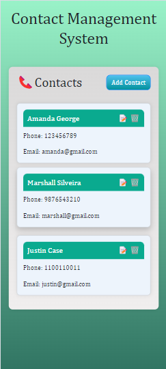
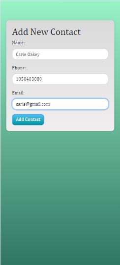
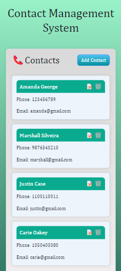
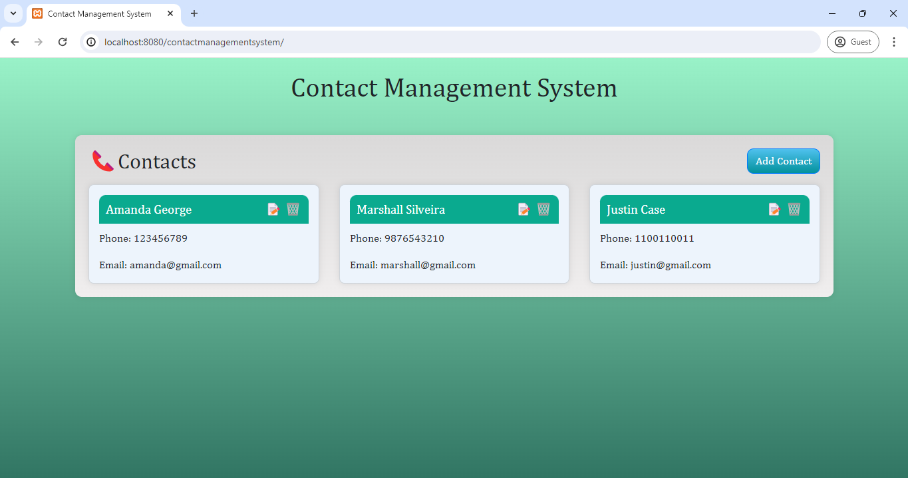
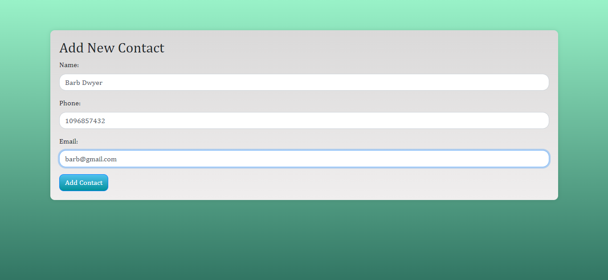
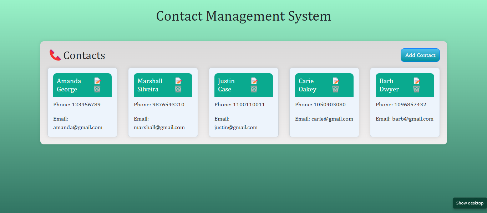

# PRODIGY_SD_03
Simple Contact Management System App

## Task 3: Implement a Simple Contact Management System

### Objective
This project aims to create a user-friendly application for managing contact information through a graphical user interface (GUI). It allows users to add, view, edit, and delete contacts easily.

### Features
- **Add Contact**: Enter name, phone number, and email to add a new contact.
- **View Contacts**: Display all contacts with their details.
- **Edit Contact**: Modify existing contact details.
- **Delete Contact**: Remove unwanted contacts from the list.
- **Persistent Storage**: Contacts are stored securely for future use.

### Technologies Used
- **Language**: PHP
- **GUI Framework**: HTML/CSS with Bootstrap for responsive design
- **Storage**: MySQL database for storing contact information

### Visualization













### Prerequisites
To run this application, you need to have the following installed on your system:
- **XAMPP**: An Apache distribution containing PHP and MySQL
- **Bootstrap**: Ensure the Bootstrap folder is included in the project files for a decent UI

### Installation and Setup
1. **Download and Install XAMPP**:
    - Download XAMPP from the [official website](https://www.apachefriends.org/index.html).
    - Follow the installation instructions specific to your operating system.

2. **Start XAMPP**:
    - Open the XAMPP Control Panel.
    - Start the Apache and MySQL modules.

3. **Set Up the Project Files**:
    - Download or clone the project repository to your local machine.
    - Place the project folder inside the `htdocs` directory of your XAMPP installation. For example: `C:\xampp\htdocs\ContactManagementSystem`.

4. **Import the Database**:
    - Open your web browser and go to `http://localhost/phpmyadmin`.
    - Create a new database named `contact_manager`.
    - Import the provided SQL file (`contacts.sql`) into the `contact_manager` database. This will create the necessary tables and triggers.

5. **Ensure Bootstrap is Included**:
    - Make sure the `bootstrap-4.5.3-dist` folder is included in the project directory structure.
    - The folder structure should look something like this:
      ```
      ContactManagementSystem/
      ├── bootstrap-4.5.3-dist/
      │   ├── css/
      │   │   └── bootstrap.min.css
      │   └── js/
      │       └── bootstrap.min.js
      ├── css/
      │   └── styles.css
      ├── images/
      │   └── desktop1
      │   └── desktop2
      │   └── desktop3
      │   └── mobile1
      │   └── mobile2
      │   └── mobile3
      ├── contacts.sql
      ├── cofig.php
      ├── index.php
      ├── add.php
      ├── edit.php
      └── delete.php
      ```

6. **Run the Application**:
    - Open your web browser and go to `http://localhost/ContactManagementSystem`.
    - You should see the home page of the Simple Contact Management System App.

### Usage
- **Add Contact**: Use the "Add Contact" form to enter new contact details.
- **View Contacts**: Navigate to the "Index.php" page to see a list of all contacts.
- **Edit Contact**: Click on the "Edit" icon next to a contact to modify its details.
- **Delete Contact**: Click on the "Delete" icon next to a contact to remove it from the list.

### Troubleshooting
- If you encounter any issues, ensure that XAMPP is running and that the Apache and MySQL modules are active.
- Check that the database has been imported correctly and that the database connection details in your PHP files are accurate.
- Verify that the Bootstrap files are correctly referenced in your HTML code.

### Project Documentation
For detailed information about the project setup, usage, and troubleshooting, please refer to the following sections:

#### Database Configuration
- Ensure that the database configuration in your PHP files (`config.php`) matches the details of your MySQL setup.
- Example configuration:
  ```php
  <?php
  $servername = "localhost";
  $username = "root";
  $password = "";
  $dbname = "contact_manager";

  // Create connection
  $conn = new mysqli($servername, $username, $password, $dbname);

  // Check connection
  if ($conn->connect_error) {
      die("Connection failed: " . $conn->connect_error);
  }
  ?>
